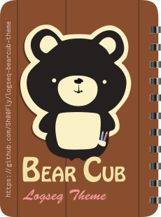

<h1 align="center">
    
     
    Bear Cub Theme for Logseq
</h1>

> *"Order leads to all the virtues, but what leads to order?"*
> 
> *-B.C. Lichtenberg.*

The Bear Cub theme is minimalistic and functional.  This theme doesn't distract you with an explosion of color and graphical elements. Instead, it helps you stay focused. It creates a clear distinction between different structural and functional elements, which helps you see a bigger picture at a glance at any time.

## Screenshots
### Dark Theme

Please note: built-in bullet threading, unobtrusive page and block properties, clearly noticeable collapsed blocks, easily distinguishable block links, block embeds and tags.  
 

Please note: Todo items are clearly discernible, but done items fade out of attention. Syntax highlighting in the code block is not part of this theme. It is configured through [CodeMirror themes](https://codemirror.net/5/demo/theme.html). More on this [here](https://github.com/logseq/logseq/pull/3699).
 

Please note: page and block properties take up less room on the screen and stay unobtrusive until you bring your attention to them and start interacting with them.
 

### Light Theme

Please note: built-in bullet threading, unobtrusive page and block properties, clearly noticeable collapsed blocks, easily distinguishable block links, block embeds and tags.  
 

Please note: Todo items are clearly discernible, but done items fade out of attention. Syntax highlighting in the code block is not part of this theme. It is configured through [CodeMirror themes](https://codemirror.net/5/demo/theme.html). More on this [here](https://github.com/logseq/logseq/pull/3699).
 

Please note: page and block properties take up less room and stay unobtrusive until you bring your attention to them and start interacting with them.
 

## Installation

- In the Logseq app click «...» and select «Plugins» (or press `t p`).
- In the «Plugins» window, click on the «Marketplace» button.
- Then select the «Themes» tab.
- Find the «Bear Cub» theme and click install.
- Close the «Plugins» window.
- Click on «...» and select «Themes» (or press `t i`)
- In the «Themes» window, select the «Bear Cub» theme.

- To switch between Light and Dark themes press `t t` or click on «...» and then «Settings» and select «Light» or «Dark» in the  «Theme modes»  section on the «General» page.

**Note:** The Bear Cub theme incorporates bullet threading. Therefore, to avoid conflicts, please disable the Bullet Threading plugin if you have it installed in your Logseq.

## Support my work
>*"Appreciation is a wonderful thing: it makes what is excellent in others belong to us as well."*
>
> *-Voltaire*

I hope my work brought some joy into your day! Let me know,

## Bugs and improvement ideas

Bugs, improvement ideas, etc. can be submitted under "Issues" on the theme's [GitHub](https://github.com/Sh00Fly/logseq-bear-cub-theme) page. 

## Credits
The Bear Cub is a theme for [Logseq](https://logseq.com) - a privacy-first, open-source platform for knowledge management and collaboration (© 2023 Logseq, Inc)) under [AGPL-3.0 license](https://github.com/logseq/logseq/blob/master/LICENSE.md).

The Bear Cub theme is based on Alexander Rink's [Bear Theme](https://github.com/rcvd/logseq-bear-theme) (Copyright (c) 2021 Alexander Rink) under [MIT License](https://github.com/rcvd/logseq-bear-theme/blob/main/LICENSE) terms. 

The Bear Cub theme incorporates Peng Xiao's [Bullet Threading](https://github.com/pengx17/logseq-plugin-bullet-threading) plugin, which is a wrapper for [Dev Theme](https://github.com/pengx17/logseq-dev-theme). Both are (Copyright (c) 2021 Peng Xiao) under [MIT License](https://github.com/pengx17/logseq-plugin-bullet-threading/blob/master/LICENSE) terms.

The Bear Cub theme utilizes [Nunito Sans Fonts](https://github.com/Fonthausen/NunitoSans)  (Copyright 2016 The Nunito Sans Project Authors) under [SIL Open Font License, 1.1](https://github.com/googlefonts/NunitoSans/blob/main/OFL.txt), and [Source Code Pro](https://github.com/adobe-fonts/source-code-pro) fonts (© 2023 Adobe (http://www.adobe.com/)), with Reserved Font Name 'Source'. All Rights Reserved. Source is a trademark of Adobe in the United States and/or other countries under [SIL Open Font License 1.1](https://github.com/adobe-fonts/source-code-pro/blob/release/LICENSE.md) 

---

    Copyright © 2023 <a href="https://github.com/Sh00Fly">Sh00Fly</a>

[MIT License](https://github.com/Sh00Fly/logseq-bear-cub-theme/blob/main/LICENSE)

